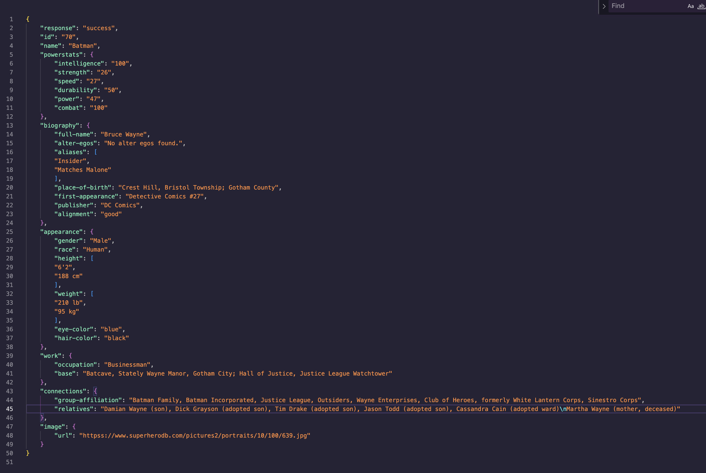

# v03

Programmet körs från en prompt i v03 katalogen med kommandot

`dart run bin/v03.dart`


---

Uppgift.

Skapa en class HeroModel, ska kunna innehålla följande datapunkter med strukturen :



Meningen är att ni ska först!! försöka skriva det för hand hur klassen ska vara och sen ev dubbelkolla med ai. - Do the struggle first, confirm with chatGPT -
Vilka värden tror ni är optionals? eller är inga det? Kanske bra o skriva ner hela Json till en fil i projektet? Borde ta max 60 - 90 min.

- Skapa en abstract class HeroDataManaging och fundera vad som kommer krävas?
- Vilka funktioner behöver jag kunna kräva och kanske mocka/testa med egen data?
- Vilka variabler kan kanske behövas?
- Vad mer?


- Skapa en singleton HeroDataManager som ( fel av mig med extends ) implements HeroDataManaging, använd factory.
- Klassen ska innehålla en lista som tar datatypen HeroModel.
  ( Har du byggt en lokal sparning / databas använd den )
- Implementera funktioner som, saveHero, getHeroList, searchHero som blir ett krav.
- Viktigt med Future och async - await och bygg det med snyggast user experience.
- Använd den överallt i appen där nåt med hero data behöver hanteras..


\- Hur bör ni lägga mapparna och filerna för att lätt kunna hålla koll på dem?
en mapp som heter models och en managers kan va bra att ha.
Diskutera tillsammans och hjälps åt.

Kan filnamn skrivas med stora bokstäver? Vad händer om man gör det?

Next level, post MVP:
- Skriv ett valfritt test eller flera!
- Mocka 3 hjältar
- Testa HeroDataManager med mockad data.
- Kan du göra en json med mockad data?
- Titta på hur du parsar den till ett HeroModel objekt.
- Ny funktion i HeroDataManager, och HeroDataManaging, parseData()
- Kan man spara all data till nästa uppstart ? Cache ?
- Splitta upp all kod till väsentliga klasser, använd singletons.
- Använd get_it libbet för att göra singletons bättre!


---

### Föregående vecka

Programmet ska visa en meny med följande alternativ och ska enbart dö när vi har tryckt på 4:

mvp:
1. Lägg till hjälte – användaren skriver in namn, styrka (int), och kanske en specialkraft.
2. Visa hjältar – skriv ut alla hjältar i listan. Sortera dem efter styrka (starkast först).
3. Sök – låt användaren skriva in en bokstav eller ett namn och visa matchande hjältar.
4. Avsluta – stäng programmet.

⸻

Krav:
- Använd List<Map för att lagra hjältarna.

```
listexempel = [
{
    "name": "Batman",
    "powerstats": {
        "strength": "12"
    } ,
    "appearance": {
        "gender": "Male",
        "race": "Human"
    }
    *"biography": {
        "alignment": ""  
    }
}
];
```

- Använd sort för att ordna hjältarna efter styrka.
- Använd forEach för att skriva ut listan snyggt.
- Switch/case
  Tänk på att skapa återanvändbar kod med funktioner.

Vi vill använda: List<Map<String, dynamic>> heroes = [ ]

⸻

Bonusidéer (för den som vill levela upp):
- Ge varje hjälte ett ID.
- Lägg till en egenskap “alignment” (god/ond). *
- Visa en topplista över de 3 starkaste hjältarna.
- Skapa ett test
- Hur sparar du hjältarna lokalt så att de finns kvar vid varje start?
- Filtrera fram hjältar i ordning beroende på input från menyn
- Har du mer tid, go wild and crazy med design.
